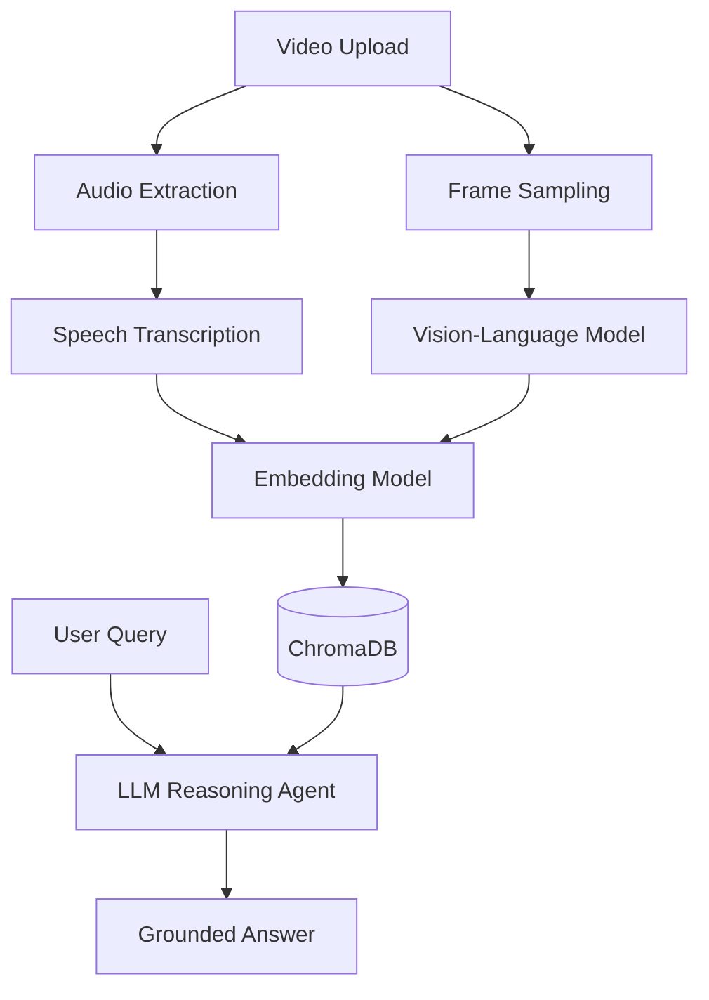

### **Multimodal RAG-Based Video Reasoning Agent**

> Upload Zoom or YouTube videos and chat with them.
> VideoBrain analyzes videos frame-by-frame using vision models, transcribes speech with timestamps, stores multimodal knowledge in a RAG pipeline, and answers questions with grounded, time-aware reasoning.

---

## 📺 Video Demo

<p align="center">
  <video src="https://github.com/user-attachments/assets/4f11695b-de14-4e76-bc44-4f4272319d3e" width="100%" controls></video>
</p>

---

## 🚀 What VideoBrain Does

VideoBrain enables **deep understanding of videos** by combining **visual perception**, **audio transcription**, and **retrieval-augmented reasoning**.

Instead of keyword search, it lets you **ask natural questions** and get answers grounded in **what was said**, **what was shown**, and **when it happened**.

---

## 🧩 Core Capabilities

* 📹 Upload **Zoom recordings or YouTube videos**
* 🖼️ Extract frames at fixed intervals and generate **frame-by-frame visual descriptions**
* 🎙️ Transcribe audio with **precise timestamps**
* 🧠 Store visual + audio knowledge in a **multimodal RAG index**
* 💬 Ask questions and receive **timestamp-grounded answers**

---

## 🤖 System Pipeline

### 1. Visual Understanding
* Video frames sampled every few seconds
* Vision-language model generates detailed scene and action descriptions

### 2. Audio Understanding
* Audio extracted using FFmpeg
* Speech transcribed with timestamps using Whisper

### 3. Multimodal RAG Memory
* Visual descriptions and transcripts embedded into a shared vector space
* Stored in ChromaDB for semantic retrieval

### 4. Reasoning Agent
* User queries trigger RAG retrieval
* Large language model synthesizes multimodal evidence into a single answer

---

## 🏗️ Architecture Overview



---

## 🛠️ Tech Stack

* **Vision Model**: Qwen2.5-VL
* **Speech Recognition**: OpenAI Whisper
* **Reasoning LLM**: Llama-3.3-70B (via Groq API)
* **Vector Database**: ChromaDB
* **Agent Orchestration**: LangGraph
* **Backend**: FastAPI
* **Frontend**: React
* **Video Processing**: FFmpeg, OpenCV

---

## 🚀 Getting Started

### 1. Prerequisites
* **FFmpeg** installed on your system.
* **Conda** for environment management.
* API Keys for: **Groq**, **HuggingFace**, and **Google Gemini** (stored in `.env`).

### 2. Setup Environment
```bash
conda create -n video_brain python=3.10
conda activate video_brain
pip install -r requirements.txt
```

### 3. Configure Environment Variables
Create a `.env` file in the root directory:
```env
GROQ_API_KEY=your_key
HF_TOKEN=your_token
GOOGLE_API_KEY=your_key
```

### 4. Run the Backend
```bash
cd backend
python main.py
```
*API will be available at `http://localhost:8000`*

### 5. Run the Frontend
```bash
cd frontend
npm install
npm run dev
```
*UI will be available at `http://localhost:5173`*

---

## 🎯 Use Cases

* 📚 Lecture & course video understanding
* 🧑💻 Zoom meeting analysis
* 🎥 Technical tutorial search
* 🧠 Research & educational AI agents
* 🗂️ Long-form video knowledge extraction

---

## 🔮 Future Improvements

* OCR from slides and code screens
* Scene segmentation & shot detection
* Temporal attention across frames
* Multi-video cross-RAG reasoning
